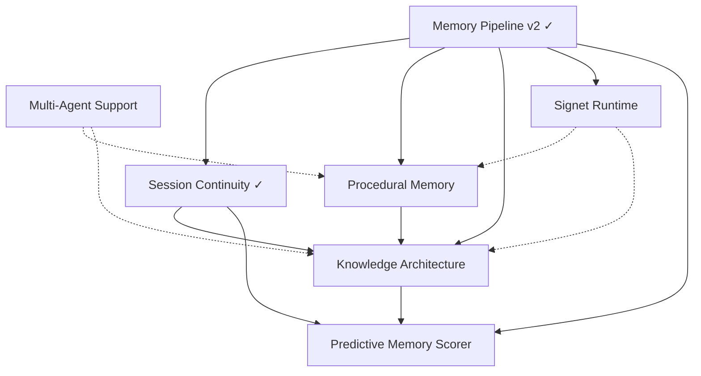

# Spec Index and Integration Contract

This is the planning control plane for specs and the integration contract
that defines how approved specs compose into a coherent system. If we are
deciding what ships next, this file is the first stop. If we are building
a spec, this file defines how it connects to everything else.

Source of truth for dependency metadata:
- `docs/specs/dependencies.yaml`

Conceptual north star:
- `docs/KNOWLEDGE-ARCHITECTURE.md`

---

## System Graph

Solid arrows = hard dependency. Dashed = integration contract (can build
in parallel, interfaces must align before merge).

---

## Cross-Cutting Invariants

These rules apply to ALL approved specs. Any spec that contradicts
these must be updated to conform.

### 1. Agent scoping is universal

Every table that stores user-facing data MUST include an `agent_id`
column. Nothing is global by default. Multi-agent support is not an
afterthought — it is a first-class column from day one.

Tables affected: `memories`, `entities`, `entity_aspects`,
`entity_attributes`, `entity_dependencies`, `skill_meta`, `task_meta`,
`session_checkpoints`, `session_memories`, `predictor_comparisons`.

Note: `entities` (migration 002) predates this invariant and does not
yet have `agent_id`. Migration 019 (KA-1) backfills it. `skill_meta`
(migration 018) already has `agent_id`.

Scoping rule: queries filter by `agent_id` unless explicitly requesting
cross-agent results (e.g., shared skill lookup with allowlist).

The `agent_id` column is infrastructure for database-level tenant
isolation, not a knowledge architecture concern. It exists on every
table for the same reason: so multiple agents sharing the same SQLite
file don't step on each other's data.

Skills are scoped to `agent_id` in the graph. The filesystem pool
(`~/.agents/skills/`) is shared, but graph nodes (entity + skill_meta +
embeddings) are per-agent. Each agent gets its own skill entity with its
own usage stats, decay, and relation edges.

### 2. Importance is structural, not arbitrary

`docs/KNOWLEDGE-ARCHITECTURE.md` is authoritative on importance.

Importance is NOT a float assigned by heuristic. It is computed from
structural density:
- Entity importance = f(aspect count, attribute count, constraint count,
  dependency edges, access frequency, user-implied signals)
- Aspect weight = f(attribute density, constraint density, access
  patterns)
- The predictive scorer receives structural density as input features,
  not a pre-computed importance float

The existing `importance` column on `memories` remains for backwards
compatibility and cold-start scoring, but the structural computation
is the source of truth once KA tables are populated.

### 3. Entity type taxonomy is canonical

The knowledge architecture schema defines the canonical entity types:
`person`, `project`, `system`, `tool`, `concept`, `skill`, `task`,
`unknown`.

All specs that create entities MUST use this taxonomy. Procedural memory
creates `entity_type = 'skill'`. Multi-agent creates agent-scoped
entities. The taxonomy is not extensible without updating KA.

### 4. Scorer consumes all available signals

The predictive memory scorer takes every input that exists. Structural
features from KA (entity slot, aspect slot, is_constraint, structural
density), procedural signals (skill usage, decay rate, role), continuity
signals (checkpoint recency, prompt count), behavioral signals (FTS
hits, access patterns), temporal signals (time of day, day of week,
session gap).

More inputs with verifiable grading is always better than curated
inputs. The model learns to ignore irrelevant features. The metric
(NDCG@10 on continuity scores) is the arbiter.

### 5. Constraints always surface

When an entity is in scope during a session, its constraints
(`entity_attributes` where `kind = 'constraint'`) are injected
regardless of score rank. The predictive scorer may rank them but
cannot suppress them. This is a hard retrieval invariant.

---

## Integration Contracts

### Procedural Memory <-> Knowledge Architecture

- Procedural memory creates skill entities with `entity_type = 'skill'`
  and `skill_meta` for runtime behavior (decay rate, use count, fs path,
  role, triggers).
- Knowledge architecture adds `entity_aspects` and `entity_attributes`
  on top. Skills can have aspects (e.g., "deployment capabilities",
  "browser automation features") and attributes organized under those
  aspects.
- KA's `entity_dependencies` captures structural edges between skills
  and other entities (e.g., `skill:wrangler` -> `entity:cloudflare`).
  Procedural memory's `relations` table captures skill-to-skill edges
  (`requires`, `complements`, `often_used_with`).
- Both coexist. `relations` is for skill-specific typed edges.
  `entity_dependencies` is for cross-type structural edges.
- KA structural assignment stage runs AFTER procedural memory creates
  the skill entity. It enriches with aspects/attributes, it does not
  replace skill_meta.

### Procedural Memory <-> Predictive Scorer

- Scorer pre-filter must respect procedural decay rates (`0.99^days`
  with `minImportance` floor) when computing `effectiveScore()` for
  skill-type memories.
- Scorer feature payload includes: `decay_rate`, `use_count`,
  `last_used_at`, `role`, `is_skill` indicator.
- Skills with `minImportance` floor cannot be eliminated during
  pre-filtering. They may rank low but must remain in the candidate
  pool.

### Knowledge Architecture <-> Predictive Scorer

- Traversal-defined candidate pool is the primary retrieval floor.
  Scorer operates on `traversal pool ∪ effectiveScore top-50 ∪
  embedding top-50`.
- Structural features per candidate: `entity_slot` (hashed entity ID),
  `aspect_slot` (hashed primary aspect), `is_constraint` (boolean),
  `structural_density` (aspect count + attribute count for the parent
  entity).
- Scorer evaluation reports include per-entity and per-project slices,
  not only global EMA.
- **Feedback direction (KA-6):** Behavioral signals flow BACK to the
  graph. FTS overlap (memories the user searched for during a session)
  feeds back to aspect weights, confirming which structural bets paid
  off. Per-entity predictor win rates surface as graph health signals.
  Superseded memory labels propagate to entity_attributes status.
  Without this feedback loop, structural weights stagnate and the
  graph diverges from what the user actually needs.
- **Entity pinning (KA-6):** Users can pin entities as always-focal,
  front-loading importance before behavioral evidence accumulates.
  Pinned entities are training data for the predictor — the manual
  exploration mechanism that the predictor eventually learns to
  replicate autonomously. See `docs/KNOWLEDGE-ARCHITECTURE.md`
  section "Love, Hate, and the Exploration Problem" for rationale.

### Knowledge Architecture <-> Session Continuity

- Checkpoint digests include optional structural snapshot: focal
  entities, active aspects, surfaced constraints.
- Recovery injection prioritizes structural snapshots over raw narrative
  when budget is tight.
- Continuity scorer label quality improves when session-end evaluation
  knows which constraints and aspects were in play.

### Signet Runtime <-> Procedural Memory

- Runtime context assembly calls `/api/skills/suggest` (from procedural
  memory spec) to surface relevant skills during session-start and
  optionally per-turn.
- Runtime tool registry discovers installed skills. When a skill is
  invoked, runtime calls `POST /api/skills/used` to record usage.
- Runtime pre-generation research phase may query skill graph for
  domain-relevant capabilities before model generation.

### Signet Runtime <-> Knowledge Architecture

- Runtime session-start calls the traversal retrieval path (KA-3) to
  resolve focal entities and walk their graphs for context assembly.
- Runtime provides project path and session signals that KA uses to
  resolve focal entities.
- Runtime does not implement traversal logic — it calls daemon API
  endpoints that KA defines.

### Multi-Agent <-> All Specs

- `agent_id` column appears on every data table (see invariant 1).
- Agent roster in `agent.yaml` defines which agents exist.
- Identity inheritance: agent subdirs override root-level files.
- Skills: shared filesystem pool, per-agent graph nodes and usage stats.
- Memory queries always include agent scope filter.
- The daemon serves both single-agent and multi-agent installs. All new
  API params are optional with sensible defaults (no `agent_id` =
  `"default"` agent = current single-agent behavior).

---

## Build Sequence

Phase ordering based on hard dependencies and integration contracts.

### Wave 1 (parallel, no cross-dependencies)

- **Procedural Memory P1**: schema + enrichment + node creation
  - Creates `skill_meta` table, skill entities, frontmatter enrichment
  - Unblocks KA structural assignment
- **Signet Runtime Phase 1**: scaffold + CLI channel
  - Independent of cognition stack, talks to daemon API only
- **Multi-Agent Phase 1-3**: core types + agent registry + DB schema
  - Adds `agent_id` columns across existing tables
  - Should land early so other specs build on scoped tables

### Wave 2 (depends on Wave 1)

- **Knowledge Architecture KA-1 + KA-2**: schema + structural assignment
  - Requires skill entities from procedural memory P1
  - Adds `entity_aspects`, `entity_attributes`, `entity_dependencies`,
    `task_meta`
  - Structural assignment stage in extraction pipeline
- **Procedural Memory P2**: usage tracking + linking
  - Parallel with KA-2
- **Predictive Scorer Phase 0**: data pipeline prerequisites
  - `session_memories` table, improved continuity scoring
  - Can start parallel with KA work

### Wave 3 (depends on Wave 2)

- **Knowledge Architecture KA-3**: traversal retrieval path
  - Wires session-start and recall to include traversal candidates
  - Enforces constraint surfacing invariant
- **Predictive Scorer Phase 1**: Rust crate scaffold + autograd
  - Parallel with KA-3
- **Procedural Memory P3**: implicit relation computation
  - Needs usage data from P2

### Wave 4 (depends on Wave 3)

- **Knowledge Architecture KA-4**: predictor coupling
  - Structural features in scorer payload
- **Predictive Scorer Phase 2-3**: training pipeline + daemon integration
  - Requires KA structural features
- **Procedural Memory P4**: retrieval and suggestion endpoints
- **Signet Runtime Phase 2**: built-in tools + pre-generation phase

### Wave 5 (polish + feedback)

- **Procedural Memory P5**: dashboard visualization
- **Predictive Scorer Phase 4**: observability + dashboard
- **Knowledge Architecture KA-5**: continuity + dashboard
- **Knowledge Architecture KA-6**: entity pinning + behavioral feedback
  loop (FTS overlap → aspect weight, aspect decay, per-entity health,
  superseded propagation). See `docs/KNOWLEDGE-ARCHITECTURE.md` section
  "Love, Hate, and the Exploration Problem" for rationale.
- **Signet Runtime Phase 3**: HTTP channel + adapter retrofit
- **Multi-Agent Phase 4+**: daemon API, harness sync, CLI, dashboard

---

## Spec Registry

Legend:
- `planning`: design in progress
- `approved`: accepted design, pending or partial implementation
- `complete`: delivered baseline or merged strategy
- `reference`: directional or notebook artifact, not an implementation contract

| ID | Status | Path | Hard Depends On | Blocks |
|---|---|---|---|---|
| `memory-pipeline-v2` | complete | `docs/specs/complete/memory-pipeline-plan.md` | - | `session-continuity-protocol`, `procedural-memory-plan`, `knowledge-architecture-schema`, `predictive-memory-scorer`, `signet-runtime` |
| `session-continuity-protocol` | complete | `docs/specs/complete/session-continuity-protocol.md` | `memory-pipeline-v2` | `knowledge-architecture-schema`, `predictive-memory-scorer` |
| `procedural-memory-plan` | approved | `docs/specs/approved/procedural-memory-plan.md` | `memory-pipeline-v2` | `knowledge-architecture-schema` |
| `knowledge-architecture-schema` | approved | `docs/specs/approved/knowledge-architecture-schema.md` | `memory-pipeline-v2`, `session-continuity-protocol`, `procedural-memory-plan` | `predictive-memory-scorer` |
| `predictive-memory-scorer` | approved | `docs/specs/approved/predictive-memory-scorer.md` | `memory-pipeline-v2`, `knowledge-architecture-schema`, `session-continuity-protocol` | - |
| `multi-agent-support` | approved | `docs/specs/approved/multi-agent-support.md` | `memory-pipeline-v2` | - |
| `signet-runtime` | approved | `docs/specs/approved/signet-runtime.md` | `memory-pipeline-v2` | - |
| `daemon-refactor` | planning | `docs/specs/planning/daemon-refactor.md` | - | `daemon-refactor-plan` |
| `daemon-refactor-plan` | planning | `docs/specs/planning/daemon-refactor-plan.md` | `daemon-refactor` | - |
| `daemon-rust-rewrite` | planning | `docs/specs/planning/daemon-rust-rewrite.md` | `memory-pipeline-v2` | - |
| `signet-roadmap-spec` | planning | `docs/specs/planning/signet-roadmap-spec.md` | - | - |
| `openclaw-integration-strategy` | complete | `docs/specs/complete/openclaw-integration-strategy.md` | - | `openclaw-importance-scoring-pr` |
| `openclaw-importance-scoring-pr` | complete | `docs/specs/complete/openclaw-importance-scoring-pr.md` | `openclaw-integration-strategy` | - |
| `notebook-dump-2026-02-25` | reference | `docs/specs/planning/notebook-dump-2026-02-25.md` | - | - |

---

## Dependency Tracking Rules

1. Every new spec gets a stable ID and entry in `dependencies.yaml`.
2. If a spec introduces a new hard dependency, update both:
   - `docs/specs/dependencies.yaml`
   - this file's registry and graph if the dependency is on the critical path.
3. Hard dependency means: implementation work should not merge ahead of the
   dependency unless explicitly marked partial/spike.
4. Soft dependency means: work can run in parallel, but interfaces must be
   locked before GA.
5. Cross-cutting invariants (above) override individual spec decisions.
   If a spec contradicts an invariant, the spec must be updated.

Validation command:
- `bun scripts/spec-deps-check.ts`
- Script: `scripts/spec-deps-check.ts`
- Checks: unknown IDs, hard-dependency cycles, missing spec paths,
  and `INDEX.md` <-> `dependencies.yaml` drift (ID/status/path).
