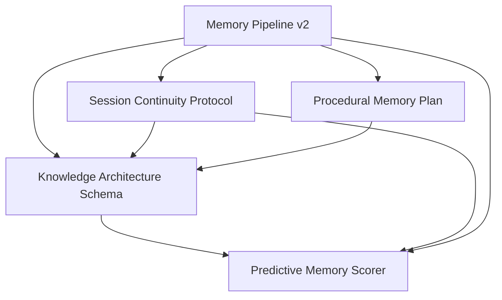

# Spec Index and Dependency Graph

This is the planning control plane for specs. If we are deciding what ships
next, this file is the first stop.

Source of truth for dependency metadata:
- `docs/specs/dependencies.yaml`

---

## Core Cognition Graph

Interpretation:
- `Memory Pipeline v2` is the substrate.
- `Knowledge Architecture Schema` is the structural retrieval layer.
- `Predictive Memory Scorer` ranks on top of that structure.

---

## Critical Path (Knowledge + Predictor)

1. Memory Pipeline contracts and durability (`memory-pipeline-plan`)
2. Structural schema + assignment + traversal (`knowledge-architecture-schema`)
3. Continuity signal quality (`session-continuity-protocol`)
4. Predictor ranking and comparison (`predictive-memory-scorer`)

---

## Spec Registry

Legend:
- `planning`: design in progress
- `approved`: accepted design, pending or partial implementation
- `complete`: delivered baseline or merged strategy
- `reference`: directional or notebook artifact, not an implementation contract

| ID | Status | Path | Hard Depends On | Blocks |
|---|---|---|---|---|
| `memory-pipeline-v2` | complete | `docs/specs/complete/memory-pipeline-plan.md` | - | `session-continuity-protocol`, `procedural-memory-plan`, `knowledge-architecture-schema`, `predictive-memory-scorer` |
| `session-continuity-protocol` | approved | `docs/specs/approved/session-continuity-protocol.md` | `memory-pipeline-v2` | `knowledge-architecture-schema`, `predictive-memory-scorer` |
| `procedural-memory-plan` | approved | `docs/specs/approved/procedural-memory-plan.md` | `memory-pipeline-v2` | `knowledge-architecture-schema` |
| `knowledge-architecture-schema` | planning | `docs/specs/planning/knowledge-architecture-schema.md` | `memory-pipeline-v2`, `session-continuity-protocol`, `procedural-memory-plan` | `predictive-memory-scorer` |
| `predictive-memory-scorer` | planning | `docs/specs/planning/predictive-memory-scorer.md` | `memory-pipeline-v2`, `knowledge-architecture-schema`, `session-continuity-protocol` | - |
| `daemon-refactor` | approved | `docs/specs/approved/daemon-refactor.md` | - | `daemon-refactor-plan` |
| `daemon-refactor-plan` | planning | `docs/specs/planning/daemon-refactor-plan.md` | `daemon-refactor` | - |
| `daemon-rust-rewrite` | planning | `docs/specs/planning/daemon-rust-rewrite.md` | `memory-pipeline-v2` | - |
| `multi-agent-support` | approved | `docs/specs/approved/multi-agent-support.md` | `memory-pipeline-v2` | - |
| `signet-roadmap-spec` | planning | `docs/specs/planning/signet-roadmap-spec.md` | - | - |
| `openclaw-integration-strategy` | complete | `docs/specs/complete/openclaw-integration-strategy.md` | - | `openclaw-importance-scoring-pr` |
| `openclaw-importance-scoring-pr` | complete | `docs/specs/complete/openclaw-importance-scoring-pr.md` | `openclaw-integration-strategy` | - |
| `notebook-dump-2026-02-25` | reference | `docs/specs/planning/notebook-dump-2026-02-25.md` | - | - |

---

## Dependency Tracking Rules

1. Every new spec gets a stable ID and entry in `dependencies.yaml`.
2. If a spec introduces a new hard dependency, update both:
   - `docs/specs/dependencies.yaml`
   - this file's registry and graph if the dependency is on the critical path.
3. Hard dependency means: implementation work should not merge ahead of the
   dependency unless explicitly marked partial/spike.
4. Soft dependency means: work can run in parallel, but interfaces must be
   locked before GA.

Validation command:
- `bun scripts/spec-deps-check.ts`
- Script: `scripts/spec-deps-check.ts`
- Checks: unknown IDs, hard-dependency cycles, missing spec paths,
  and `INDEX.md` <-> `dependencies.yaml` drift (ID/status/path).

---

## Suggested Next Spec Ops

1. Wire `bun scripts/spec-deps-check.ts` into CI as a required docs gate.
2. Add per-spec `Spec Metadata` blocks (ID, status, depends_on) to make each
   spec self-describing.
3. Add a dashboard/API view later, reading `dependencies.yaml`, so dependency
   drift is visible without opening docs.
