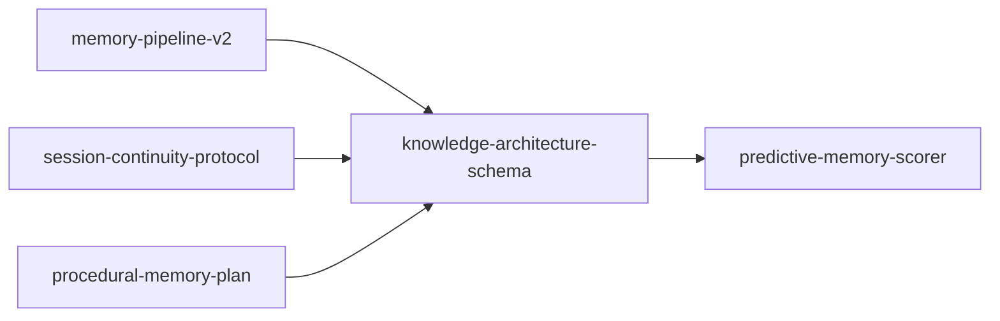

# Knowledge Architecture Schema and Traversal Spec

Status: Planning (v0)

Audience: Core + Daemon maintainers

Spec metadata:
- ID: `knowledge-architecture-schema`
- Status: `planning`
- Hard depends on: `memory-pipeline-v2`, `session-continuity-protocol`,
  `procedural-memory-plan`
- Blocks: `predictive-memory-scorer`
- Registry: `docs/specs/INDEX.md`

Related docs:
- `docs/KNOWLEDGE-ARCHITECTURE.md` (conceptual model)
- `docs/specs/planning/predictive-memory-scorer.md` (learned ranking)
- `docs/specs/complete/memory-pipeline-plan.md` (pipeline contracts)
- `docs/specs/approved/procedural-memory-plan.md` (skills as procedural memory)
- `docs/specs/approved/session-continuity-protocol.md` (checkpoint and recovery)

---

## 1) Purpose

`KNOWLEDGE-ARCHITECTURE.md` defines the conceptual model (entity -> aspect
-> attribute/constraint, plus dependency traversal). This spec turns that
model into an implementation contract with:

1. additive schema changes
2. extraction and backfill contracts
3. traversal-first retrieval contracts
4. integration points with predictive scoring and continuity checkpoints

This is the structural floor that predictive ranking should run on.

Local dependency graph:



---

## 2) Scope and Non-Goals

### In scope

1. Entity/aspect/attribute/constraint/task representation in SQLite
2. Dependency edges as explicit graph structure
3. Session-start traversal contracts for context injection
4. Cross-spec contracts with scorer, procedural memory, and continuity

### Out of scope (this revision)

1. Multi-hop planning/reasoning beyond one-hop dependency traversal
2. Automatic task execution
3. Autonomous destructive mutations without existing policy gates

---

## 3) Baseline (Current State)

Current graph-relevant state already in repo:

1. `entities`, `relations`, and `memory_entity_mentions` exist
2. `session_memories` exists and stores candidate/injection telemetry
3. `session_checkpoints` exists and stores continuity digests
4. Predictor crate and training pipeline exist through Phase 2

Current gap:

The system has entity mentions and relation edges, but no first-class
representation for aspects, constraints, or task lifecycle. Retrieval is still
primarily search/scoring-first, not traversal-first.

---

## 4) Cross-Spec Contract Map

| Spec | Produces | Consumes from this spec |
|---|---|---|
| `memory-pipeline-plan.md` | extraction + mutation pipeline | structural assignment contract, schema ownership, backfill behavior |
| `predictive-memory-scorer.md` | ranking model + training loop | traversal candidate pool, structural features (entity/aspect/constraint) |
| `procedural-memory-plan.md` | skill nodes + procedural decay | shared entity/aspect model (`entity_type='skill'`) |
| `session-continuity-protocol.md` | checkpoint + recovery | focal entity/aspect snapshot for recovery injection and training context |

Normative rule: predictive ranking is an enhancer. Traversal-defined structure
is the primary retrieval floor.

---

## 5) Data Model (Additive)

### 5.1 Entity type taxonomy

Extend `entities.entity_type` usage to the canonical set:

- `person`
- `project`
- `system`
- `tool`
- `concept`
- `skill`
- `task`
- `unknown` (fallback)

### 5.2 New table: `entity_aspects`

```sql
CREATE TABLE entity_aspects (
  id TEXT PRIMARY KEY,
  entity_id TEXT NOT NULL REFERENCES entities(id) ON DELETE CASCADE,
  name TEXT NOT NULL,
  canonical_name TEXT NOT NULL,
  weight REAL NOT NULL DEFAULT 0.5,
  created_at TEXT NOT NULL,
  updated_at TEXT NOT NULL,
  UNIQUE(entity_id, canonical_name)
);

CREATE INDEX idx_entity_aspects_entity ON entity_aspects(entity_id);
CREATE INDEX idx_entity_aspects_weight ON entity_aspects(weight DESC);
```

`weight` is structural centrality + learned utility. It is not pure frequency.

### 5.3 New table: `entity_attributes`

```sql
CREATE TABLE entity_attributes (
  id TEXT PRIMARY KEY,
  aspect_id TEXT NOT NULL REFERENCES entity_aspects(id) ON DELETE CASCADE,
  memory_id TEXT REFERENCES memories(id) ON DELETE SET NULL,
  kind TEXT NOT NULL,                 -- 'attribute' | 'constraint'
  content TEXT NOT NULL,
  normalized_content TEXT NOT NULL,
  confidence REAL NOT NULL DEFAULT 0.0,
  importance REAL NOT NULL DEFAULT 0.5,
  status TEXT NOT NULL DEFAULT 'active',  -- 'active' | 'superseded' | 'deleted'
  superseded_by TEXT,
  created_at TEXT NOT NULL,
  updated_at TEXT NOT NULL
);

CREATE INDEX idx_entity_attributes_aspect ON entity_attributes(aspect_id);
CREATE INDEX idx_entity_attributes_kind ON entity_attributes(kind);
CREATE INDEX idx_entity_attributes_status ON entity_attributes(status);
```

Constraints are first-class rows (`kind='constraint'`), not inferred tags.

### 5.4 New table: `entity_dependencies`

```sql
CREATE TABLE entity_dependencies (
  id TEXT PRIMARY KEY,
  source_entity_id TEXT NOT NULL REFERENCES entities(id) ON DELETE CASCADE,
  target_entity_id TEXT NOT NULL REFERENCES entities(id) ON DELETE CASCADE,
  aspect_id TEXT REFERENCES entity_aspects(id) ON DELETE SET NULL,
  dependency_type TEXT NOT NULL,      -- 'uses' | 'requires' | 'owned_by' | 'blocks' | 'informs'
  strength REAL NOT NULL DEFAULT 0.5,
  created_at TEXT NOT NULL,
  updated_at TEXT NOT NULL
);

CREATE INDEX idx_entity_dependencies_source ON entity_dependencies(source_entity_id);
CREATE INDEX idx_entity_dependencies_target ON entity_dependencies(target_entity_id);
```

These are explicit traversal edges. They are not similarity artifacts.

### 5.5 New table: `task_meta`

```sql
CREATE TABLE task_meta (
  entity_id TEXT PRIMARY KEY REFERENCES entities(id) ON DELETE CASCADE,
  status TEXT NOT NULL,                -- 'open' | 'in_progress' | 'blocked' | 'done' | 'cancelled'
  expires_at TEXT,
  retention_until TEXT,
  completed_at TEXT,
  updated_at TEXT NOT NULL
);

CREATE INDEX idx_task_meta_status ON task_meta(status);
CREATE INDEX idx_task_meta_retention ON task_meta(retention_until);
```

Tasks share entity structure but use separate lifecycle rules.

---

## 6) Extraction and Backfill Contracts

### 6.1 New structural assignment stage

After fact extraction and decision, pipeline runs structural assignment per
fact memory:

1. resolve primary entity (existing or new)
2. resolve/create aspect under that entity
3. classify fact as `attribute` or `constraint`
4. optionally emit dependency edges
5. for task-like facts, assign/maintain `entity_type='task'` and `task_meta`

### 6.2 Assignment invariants

1. Every active atomic fact memory should map to exactly one primary
   `entity_attributes` row.
2. Constraints always map to `kind='constraint'`.
3. Dependency edges are additive and idempotent.
4. `superseded` attributes remain auditable; they do not vanish.

### 6.3 Backfill behavior

Maintenance worker backfills unassigned legacy memories incrementally:

1. scan unassigned memories in batches
2. assign entity/aspect/attribute with confidence
3. skip low-confidence rows and record telemetry
4. never block foreground hooks

---

## 7) Retrieval Contract (Traversal First)

### 7.1 Session-start context assembly

Order of operations:

1. Resolve focal entities from session signals (project path, checkpoint,
   session key lineage, prompt hints)
2. Pull all active constraints for focal entities and one-hop dependencies
3. Pull top aspects by `weight` for each focal entity
4. Pull active attributes under those aspects
5. Materialize candidate memory IDs via `entity_attributes.memory_id`

This produces a structurally coherent candidate pool before heuristic or model
ranking runs.

### 7.2 Candidate pool fusion with predictor pre-filter

Predictor pre-filter contract changes from:

`effective top-50 U embedding top-50`

to:

`traversal pool U effective top-50 U embedding top-50`

Then dedupe and cap (configurable, default 100).

### 7.3 Hard retrieval invariant

Constraints are always surfaced when their entity is in scope, independent of
score rank.

---

## 8) Predictive Scorer Integration

`predictive-memory-scorer.md` consumes this spec in three places:

1. **Candidate quality**: scorer receives structurally coherent candidates
2. **Feature enrichment**: add structural features per candidate
   - entity slot hash
   - aspect slot hash
   - `is_constraint`
3. **Evaluation slices**: report win/loss by focal entity/project, not only
   global EMA

The predictor still earns influence via comparisons. This spec improves its
input quality and interpretability.

---

## 9) Procedural Memory Integration

`procedural-memory-plan.md` remains authoritative for skill lifecycle.

Alignment rules:

1. Skills remain `entity_type='skill'`
2. Skill metadata (`skill_meta`) remains source-of-truth for runtime skill
   behavior
3. Skill knowledge can also map into `entity_aspects` / `entity_attributes`
   for unified traversal and scoring

This keeps one graph with type-specific lifecycle rules.

---

## 10) Continuity Protocol Integration

`session-continuity-protocol.md` integration points:

1. checkpoint digests add optional structural snapshot fields:
   - focal entities
   - active aspects
   - surfaced constraints
2. recovery injection should prioritize these structural snapshots over raw
   narrative when budget is tight
3. predictor label quality improves when session-end evaluation knows which
   constraints and aspects were in play

---

## 11) Migration and Phase Plan

### KA-1 Schema and types

1. Add migration `017-knowledge-structure.ts` (`entity_aspects`,
   `entity_attributes`, `entity_dependencies`, `task_meta`)
2. Add core types and read/write helpers

### KA-2 Structural assignment in pipeline

1. Add assignment stage in summary/extraction path
2. Persist mappings for newly extracted atomic facts
3. Add telemetry for assignment confidence and coverage

### KA-3 Traversal retrieval path

1. Add traversal query builder in daemon
2. Wire session-start and recall flows to include traversal candidates
3. Enforce constraint surfacing invariant

### KA-4 Predictor coupling

1. Extend predictor request payload with structural features
2. Update comparison/audit APIs with structural slices

### KA-5 Continuity + dashboard

1. Store structural checkpoint slices
2. Surface entity/aspect/constraint context in dashboard timeline and
   predictor inspector

---

## 12) Acceptance Criteria

1. >=90% of active atomic fact memories have structural assignment
   (entity + aspect + attribute/constraint)
2. Session-start context includes constraint rows for in-scope entities with
   zero omissions in test fixtures
3. Traversal candidate pool remains bounded and deterministic
4. Predictor comparison reports include structural slices (entity/project)
5. Recovery injections include structural snapshot fields when available

---

## 13) Open Questions

1. Should aspects be free-form with canonicalization, or backed by a small
   taxonomy per entity type?
2. Should task retention default to fixed duration or confidence-driven decay?
3. Do we need a dedicated `constraints` table later for policy-level joins,
   or is `entity_attributes(kind='constraint')` sufficient?

---

## 14) Immediate Next Steps

1. Approve this spec as the implementation contract for structural retrieval.
2. Update predictive scorer Phase 3 tasks to include traversal pool fusion.
3. Draft migration `017-knowledge-structure.ts` with exact indexes and
   idempotency behavior.
4. Add a small offline benchmark set comparing traversal-first candidate
   generation vs current heuristic pre-filter.
